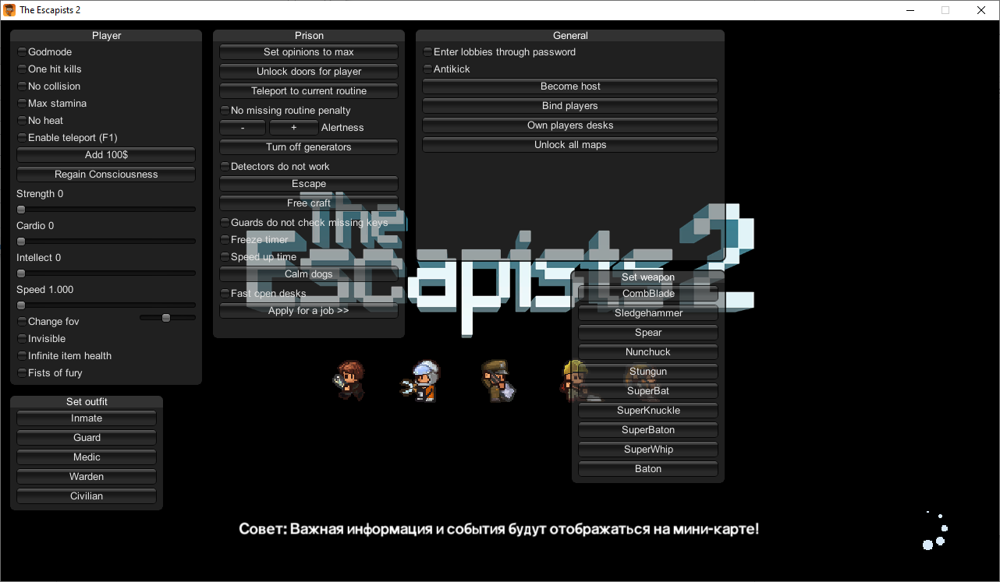

# TE2ModMenu
TE2ModMenu is a Cheat Menu for The Escapists 2.
## Disclaimer
This project is for Educational Use only. I do not condone this software being used to gain an advantage against other people. This mod was made for my university project.
## Usage
### First way
1. Add 0Harmony.dll to \TheEscapists2\TheEscapists2_Data\Managed folder of the game.
2. Inject TE2ModMenu.dll via SharpMonoInjector (recommended) or any other mono injector with the following options:
- Namespace = TE2ModMenu
- Class = Loader
- Method = Init
### Second way
Inject 0Harmony.dll and TE2ModMenu.dll using my [ModLoader](https://github.com/Sacracia/ModLoader)
## Mod options / Screenshot

   

Online unsupported options:
- No missing routine penalty
- +- Alertness
- Freeze timer
- Speed up time
- Calm dogs
- Invisible

Notices:
- Change FOV doesnt influence draw distance
- No missing routine penalty works except for roll call
- -Alertness doest work during isolation
- Free craft means crafting any item out of any three items from non-empty slots. This function is extremely UNSAFE and may cause crafting menu to freeze, only game restart is to unfreeze it. 